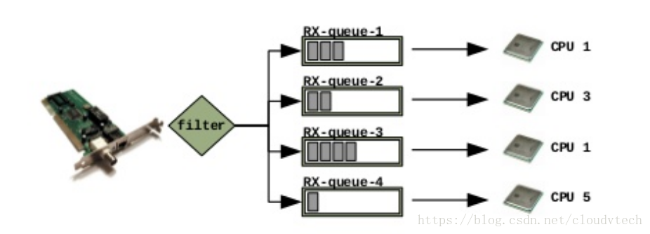
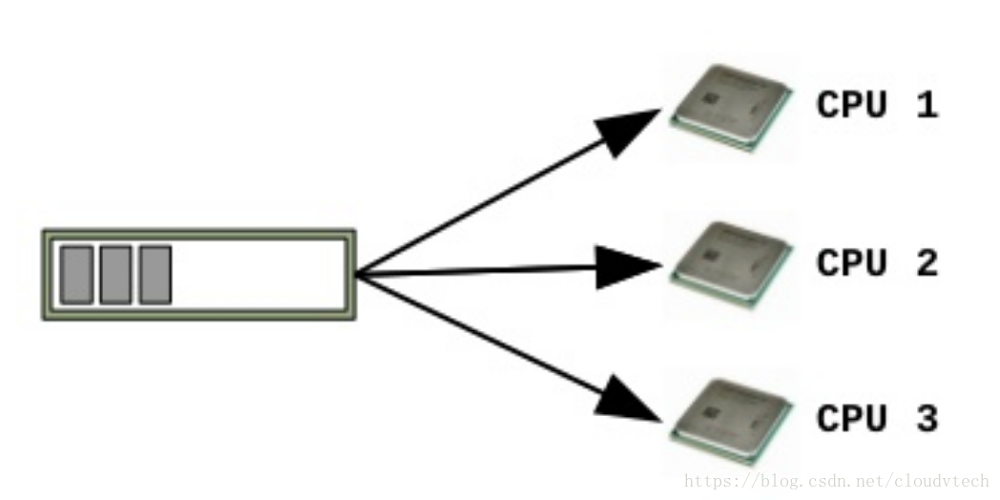
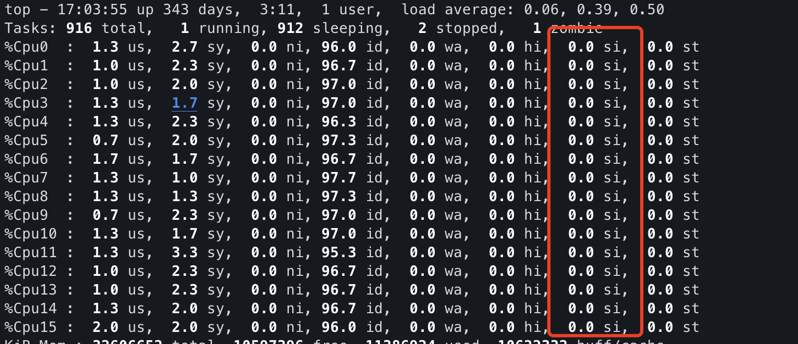

网卡收到网络包之后，会触发 硬中断。硬中断中，再触发软中断。\
在 软中断 中处理网络包 。 -- 详见 [数据包从网卡到应用层](/%E6%95%B0%E6%8D%AE%E5%8C%85%E4%BB%8E%E7%BD%91%E5%8D%A1%E5%88%B0%E5%BA%94%E7%94%A8%E5%B1%82)

为了利用多个 CPU 的并行处理能力。 NIC 网卡支持了 多队列能力 。\
不同的队列由不同的 CPU 处理。

## 背景

性能瓶颈：

* 每张网卡有一个队列(queue)，其实是ring buffer(环形队列)，内核如果取数据不及时, 则会存在丢包的情况
* 一个CPU处理一个队列的数据。通常是 cpu0。
* 一旦流量特别大, 这个CPU负载很高, 来不及处理 中断。 性能存在瓶颈

因此有了网卡多队列

```
             普通单队列                                   
   +-----------------------------+                        
   | queue                       |                        
   |                             |                        
   |   +----------+  +----------+|           +---------+  
   |   |  packet  |  |  packet  ||---------->|  CPU 0  |  
   |   +----------+  +----------+|           +---------+  
   +-----------------------------+                        
                                                    
                             开启多网卡队列               
                                                        
    +----------------------------+                       
    | queue                      |                       
    |                            |                       
    |  +----------+ +----------+ |           +---------+ 
    |  |  packet  | |  packet  | |---------> |  CPU 0  | 
    |  +----------+ +----------+ |           +---------+ 
    +----------------------------+           +---------+ 
                                             |  CPU 1  |  
                                             +---------+  
                                             +---------+  
    +----------------------------+           |  CPU 2  |  
    | queue                      |           +---------+  
    |                            |                        
    |  +----------+ +----------+ |           +---------+  
    |  |  packet  | |  packet  | |---------> |  CPU 3  |  
    |  +----------+ +----------+ |           +---------+  
    +----------------------------+                        
```

## RSS Receive Side Scaling - 硬件/驱动级别

RSS在硬件/驱动级别实现多队列\
hash函数 处理网络包： 根据四元组（源IP、目的IP、源端口和目的端口），把同一个链接的包放到同一个队列



## ethtool 调整网卡硬件 多队列数

## RPS Receive Packet Steering - 内核软件级别

RPS是内核软件实现\
帮助单队列网卡将其产生的 SoftIRQ 软中断 分派到多个CPU内核进行处理



## RFS Receive Flow Steering - RPS 的优化

RPS 的问题：处理网络包软中断的 cpu 核 与 上层应用的 cpu 核心不相同 -- 造成 cpu cache missing

RFS能够保证处理软中断和处理应用程序是同一个CPU -- 提升 cpu cache 命中率

和RPS一起配合使用

## XPS Transmit Packet Steering - 发包的内核软件优化

CPU <---> 网卡发送队列. 的对应关系\
发送软中断请求的CPU和向外发送数据包的CPU是同一个CPU

类似 RPS RFS

## 工具

### ethtool 查看网卡的 RSS 配置

Combined 应该设置值 与 nic 支持的最大值一样

```
ethtool -l eth0

Channel parameters for eth0:
Pre-set maximums:
RX:             0
TX:             0
Other:          0
Combined:       2         ### 服务器支持的最大网卡队列个数
Current hardware settings:
RX:             0
TX:             0
Other:          0
Combined:       1        ###当前设置的网卡队列个数 -> 需要修改为2
```

### CPU 软中断处理数量判断

#### 查看 io 软中断的 cpu 分布

```
cat /proc/interrupts | egrep 'CPU|virtio.*(input|output)'
```

可见：主要是 CPU 0 1 2 3 在处理软中断

```
$ cat /proc/interrupts | egrep 'CPU|virtio.*(input|output)'
           CPU0       CPU1       CPU2       CPU3       CPU4       CPU5       CPU6       CPU7       CPU8       CPU9       CPU10      CPU11      CPU12      CPU13      CPU14      CPU15
 45:  151170261          0          0          0          0          0          0          0          0          0          0          0          0          0          0          0   PCI-MSI-edge      virtio0-input.0
 46:          1          0          0          0          0          0          0          0          0          0          0          0          0          0          0          0   PCI-MSI-edge      virtio0-output.0
 47:          2  107731061          0          0          0          0          0          0          0          0          0          0          0          0          0          0   PCI-MSI-edge      virtio0-input.1
 48:          1          0          0          0          0          0          0          0          0          0          0          0          0          0          0          0   PCI-MSI-edge      virtio0-output.1
 49:          1          0  114572639          0          0          0          0          0          0          0          0          0          0          0          0          0   PCI-MSI-edge      virtio0-input.2
 50:          1          0          0          0          0          0          0          0          0          0          0          0          0          0          0          0   PCI-MSI-edge      virtio0-output.2
 51:          1          0          0  119909943          0          0          0          0          0          0          0          0          0          0          0          0   PCI-MSI-edge      virtio0-input.3
 52:          1          0          0          0          0          0          0          0          0          0          0          0          0          0          0          0   PCI-MSI-edge      virtio0-output.3
```

#### io 软中断绑定的 cpu 核

由上面 [#查看 io 软中断的 cpu 分布](#%E6%9F%A5%E7%9C%8B%20io%20%E8%BD%AF%E4%B8%AD%E6%96%AD%E7%9A%84%20cpu%20%E5%88%86%E5%B8%83) 中结果的第一列：\
处理的 irq 为 45～52\
通过下面的命令，查看软中断对应的 cpu 核

```
$ for i in {45..52}; do echo -n "Interrupt $i is allowed on CPUs "; cat /proc/irq/$i/smp_affinity_list; done
Interrupt 45 is allowed on CPUs 0
Interrupt 46 is allowed on CPUs 0
Interrupt 47 is allowed on CPUs 1
Interrupt 48 is allowed on CPUs 1
Interrupt 49 is allowed on CPUs 2
Interrupt 50 is allowed on CPUs 2
Interrupt 51 is allowed on CPUs 3
Interrupt 52 is allowed on CPUs 3
```

### CPU 软中断负载

top 中的 si 就是软中断占比(按1 显示所有的 cpu 的情况)\
如果高比如50%, 说明该CPU忙于处理中断, 通常就是收发网络IO



### RPS XPS 设置

配置文件为：\
RPS : `/sys/class/net/eth*/queues/rx*/rps_cpus`\
XPS `/sys/class/net/eth*/queues/tx*/xps_cpus`\
配置值为 16 进制。需要cpu 0，1 处理 -> 配置为 0000011 -> 3

查看配置：

```shell
$ for i in $(ls -1 /sys/class/net/eth*/queues/rx*/rps_*); do echo -n "${i}:  "  ; cat ${i}; done
/sys/class/net/eth1/queues/rx-0/rps_cpus:  ffff
/sys/class/net/eth1/queues/rx-0/rps_flow_cnt:  4096
/sys/class/net/eth1/queues/rx-1/rps_cpus:  ffff
/sys/class/net/eth1/queues/rx-1/rps_flow_cnt:  4096
/sys/class/net/eth1/queues/rx-2/rps_cpus:  ffff
/sys/class/net/eth1/queues/rx-2/rps_flow_cnt:  4096
/sys/class/net/eth1/queues/rx-3/rps_cpus:  ffff
/sys/class/net/eth1/queues/rx-3/rps_flow_cnt:  4096
```

## 参考

https://cloud.tencent.com/document/product/213/68396#.E5.A4.84.E7.90.86.E6.AD.A5.E9.AA.A4.3Ca-id.3D.22processingsteps.22.3E.3C.2Fa.3E\
https://xixiliguo.github.io/linux/multi-queue.html\
https://blog.csdn.net/cloudvtech/article/details/80182074
